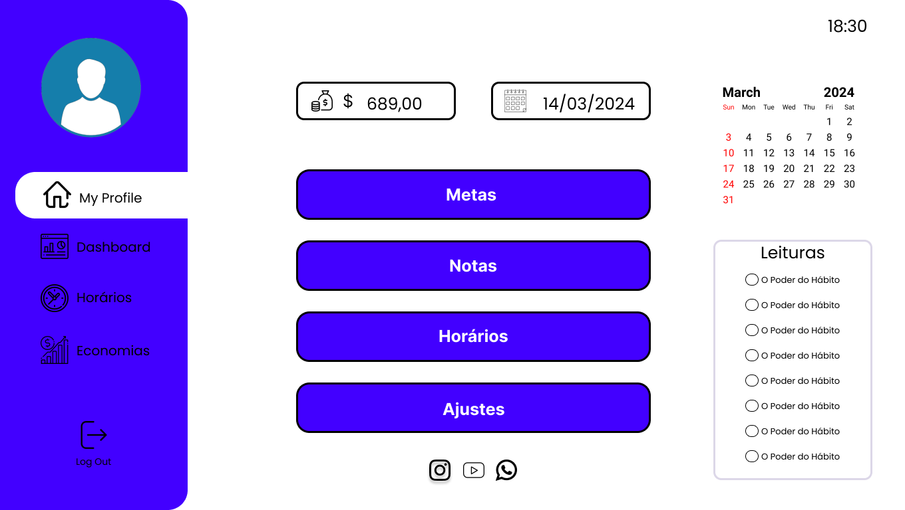

# Dashboard em Python

Este é um projeto de Dashboard desenvolvido em Python.

## Aplicação

Aqui está uma captura de tela da aplicação 



## Descrição

Este Dashboard é construído usando [Custom TKinter](https://github.com/TomSchimansky/CustomTkinter) para visualização de dados em Python. Ele fornece uma interface amigável para analisar e visualizar dados da Rotina de um usúario.

## Requisitos

- Python 3.x
- Bibliotecas necessárias (instaladas via pip, por exemplo):
  - [CustomTkinter](https://github.com/TomSchimansky/CustomTkinter)
  - [Tkinter](https://docs.python.org/pt-br/3/library/tkinter.html)
  - [Datetime](https://docs.python.org/3/library/datetime.html)
  - [Time](https://docs.python.org/3/library/time.html)
  - [Webbroswer](https://docs.python.org/3/library/webbrowser.html)

## Instalação

1. Clone este repositório:
    ```bash
    git clone https://github.com/RodriggoAlves/Dash.git
    ```

2. Instale as dependências:
    ```bash
    pip install -r requirements.txt
    ```

## Utilização

Execute o arquivo principal do Dashboard:
